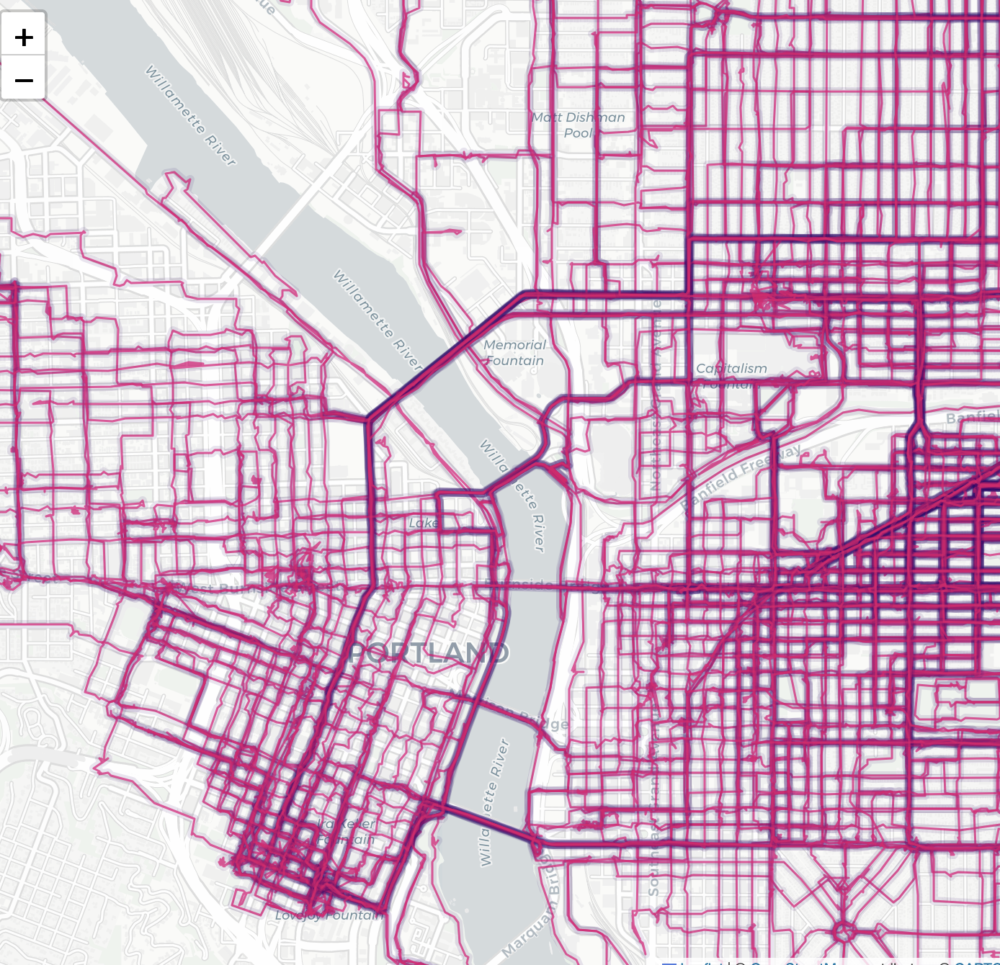
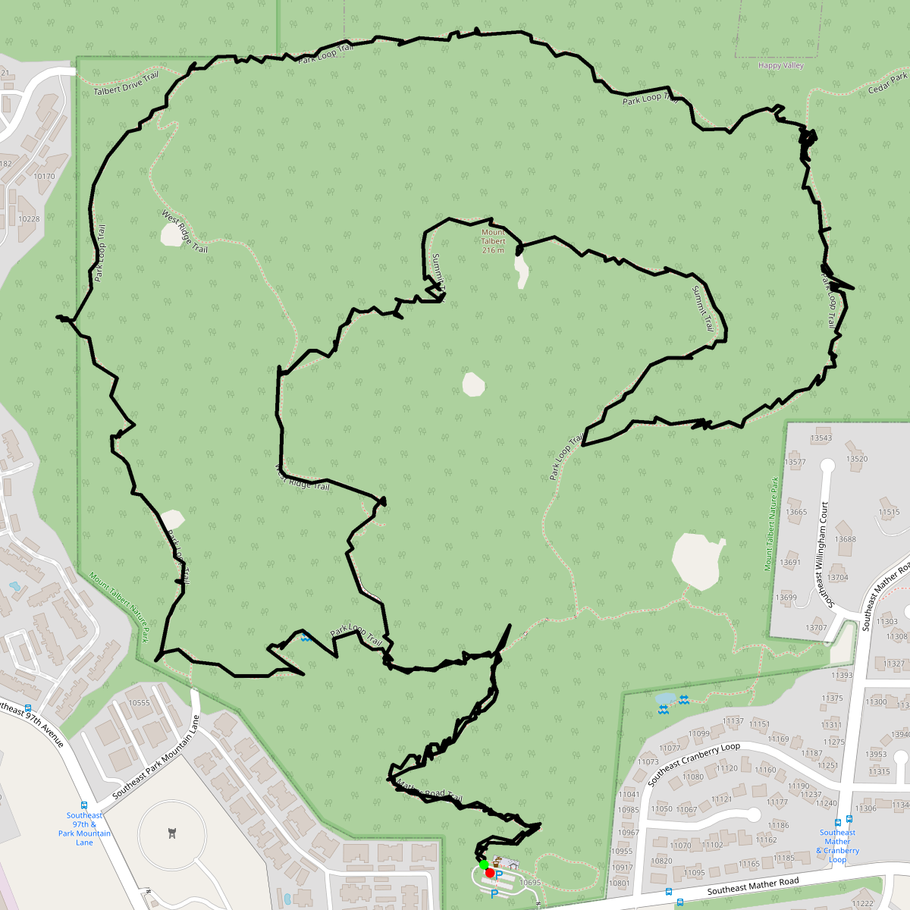
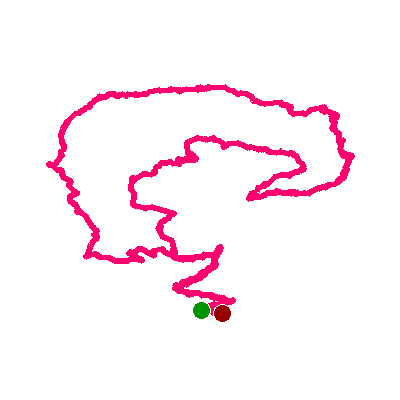
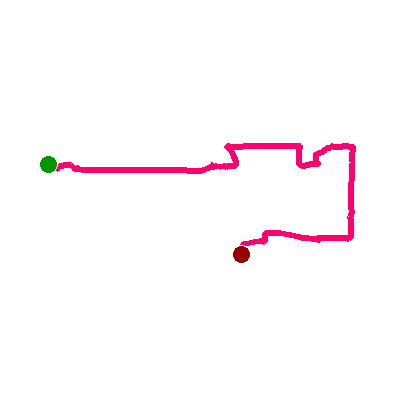
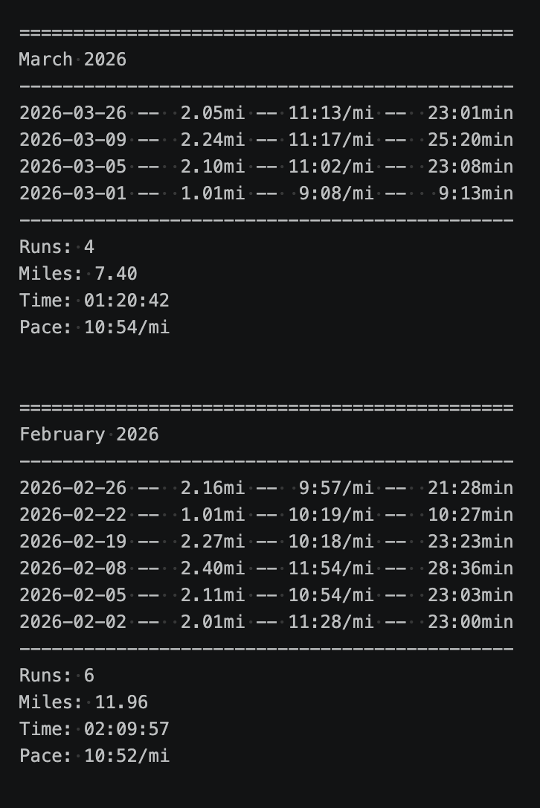

# activity-archive

A Python pipeline for exporting Strava activity data into local JSON files for analysis and long-term preservation.

The project stores raw activity data and builds derived outputs such as run logs, CSV datasets, and custom heatmaps using a JSON-first archival approach.

## Example Output

### Heatmaps



### Route Maps



### Thumbnails




### Run Log



## Setup

### stravalib

This project uses the Python library **stravalib** to interact with the Strava API.

- GitHub: https://github.com/stravalib/stravalib
- Docs: https://stravalib.readthedocs.io/

**stravalib** is essentially a thin wrapper around the Strava REST API that:

- Handles OAuth authentication
- Provides Python objects instead of raw JSON
- Exposes methods like get_activities() and get_activity_streams()

### How the Client Works

Everything revolves around

```
from stravalib import Client

client = Client()
```

But that object is useless until it’s authenticated.

Strava uses OAuth 2.0, which means:

1. You authorize your app in a browser
2. You get a code
3. You exchange that code for:
   - access_token (short-lived)
   - refresh_token (long-lived)
4. You use the access token for API requests
5. When it expires, you refresh it automatically

Before anything works, you need to create a Strava application by following the steps outlined here:

[Strava API Docs](https://developers.strava.com/docs/getting-started/#account)

You will get a `client_id` and a `client_secret`

They should be stored securely in `.env`

```conf
STRAVA_CLIENT_ID=xxxxx
STRAVA_CLIENT_SECRET=xxxxx
```

Optional personal workflow setting:

```conf
ACTIVITY_ARCHIVE_NOTES_DIR=/path/to/your/notes/activity-archive/derived
```

If set, `src/generate_run_log_md.py` will also mirror `runs_log.md` into that
directory. This is intended for personal Obsidian/Notes workflows and is not
required for normal use.

Here are some other relevant docs

[stravalib: get-started](https://github.com/stravalib/stravalib/tree/main/docs/get-started)

[stravalib: authenticate-with-strava](https://github.com/stravalib/stravalib/blob/main/docs/get-started/authenticate-with-strava.md)

[stravalib: how-to-get-strava-data-python](https://github.com/stravalib/stravalib/blob/main/docs/get-started/how-to-get-strava-data-python.md)

## How to use

### 1. Clone the repo

```bash
git clone <your-repo-url>
cd activity-archive
```

### 2. Install dependencies

```bash
pip install -r requirements.txt
```

### 3. Create .env in root

This project uses `python-dotenv` to load environment variables from this file.

```
STRAVA_CLIENT_ID=xxxxx
STRAVA_CLIENT_SECRET=xxxxx
```

Optional:

```
ACTIVITY_ARCHIVE_NOTES_DIR=/path/to/your/notes/activity-archive/derived
```

### 4. Authenticate (one-time setup)

#### Step 1 - Run `src/auth/auth_url.py`

```
python src/auth/auth_url.py
```

This prints a URL like: `https://www.strava.com/oauth/authorize?...`

#### Step 2 — Authorize in browser

1. Open the URL in your browser
2. Log into Strava and approve access
3. You will be redirected to a URL like: `http://localhost:8765/authorization?state=&code=abc123&scope=read`
4. Copy the code value `abc123`

#### Step 3 — Exchange code for tokens

Open `src/auth/exchange_code.py` and paste your code:

```
CODE = "abc123"
```

Then run `python src/auth/exchange_code.py`

This creates: `token.json` in project root.

Example `token.json`:

```json
{
  "access_token": "...",
  "refresh_token": "...",
  "expires_at": 1234567890
}
```

This file is used automatically by the rest of the pipeline.

## Exporting the data

When running the initial export you will have to do it in batches to avoid Strava's rate limits. Strava allows 100 read requests every 15 minutes and up to 1,000 daily.

For the initial export of all past workouts run the following command repeatedly, no less than 15 minutes apart,
until you have exported all of your activities.

```bash
python src/export_activities_json.py --backfill --limit 95 --sleep 0.2
```

- NOTE `--limit 98` is the practical max limit for a single batch, because listing and other requests also count against the short-term API limit. If you have recently used any requests, set that number lower.

- NOTE The backfill process is safe to re-run. If all activities have already been archived, the script will skip existing entries.

Once all the activities have been exported you can choose to export the stream data with:

```bash
python src/export_streams_json.py --limit 95 --sleep 0.2
```

For the initial export of all past workout streams run the following command repeatedly, no less than 15 minutes apart,
until you have exported all of your missing streams.

## Syncing Periodically

Once you have initially exported all of your Strava data, you can run the sync command to keep it updated as you
add more activities.

- NOTE The first time you run this command it may take a few minutes depending on how many activities you have. As it generates
  route maps, thumbnails, reports, and rebuilds the heatmaps.

```bash
python src/sync.py
```

This command orchestrates the full pipeline:

- Fetches new activities from Strava
- Downloads missing stream data
- Regenerates derived data (CSV, logs, Markdown run log, maps, thumbnails, heatmaps, running distance grid)

To rebuild only the running distance grid:

```bash
python src/generate_run_distance_grid.py
```

This writes `derived/heatmaps/running_distance_grid.html`.

Internally, this runs the individual scripts in `src/`

## Local Server

The repo includes:

- a FastAPI backend in `server/`
- a React/Vite frontend in `web/`

The backend serves generated files from `derived/`, exposes sync endpoints, and
can serve the built frontend at `/`.

Frontend development mode:

```bash
# terminal 1, repo root
.venv/bin/python -m uvicorn server.app:app --host 127.0.0.1 --port 8765

# terminal 2
cd web
npm install
npm run dev
```

Then open `http://127.0.0.1:5173`.

Built frontend mode:

```bash
cd web
npm run build
cd ..
.venv/bin/python -m uvicorn server.app:app --host 127.0.0.1 --port 8765
```

Then open `http://127.0.0.1:8765/`.

See [docs/local-server.md](docs/local-server.md) for the full frontend workflow,
sync endpoints, troubleshooting, stopping the servers, and NAS/Tailscale notes.

## Docker

For NAS deployment, this repo also includes:

- [Dockerfile](Dockerfile)
- [compose.yml](compose.yml)

See [docs/docker.md](docs/docker.md) for the single-container Docker workflow and
mounted data layout.

## Design

This project follows a JSON-first archival approach:

1. Raw Strava data is stored locally (activities + streams)
2. Derived data (CSV, logs, maps) is generated from that archive
3. The archive is never modified—only appended to

This allows:

- Full data ownership
- Reproducible transformations
- Easy reprocessing (e.g., regenerating heatmaps)

## Project Structure

```bash
# Generated directories, data
archive/
  activities/      # raw activity JSON
  streams/         # GPS + sensor data

derived/
  activities.csv   # Activity table rebuilt from archived JSON
  all_routes_map.html
  heatmaps/        # Heatmap-style HTML outputs and running distance grid
  maps/            # Full route map per activity
  thumbnails/      # Simple route line per activity

derived/reports/
    activity_log.txt # Simple activity log
    runs_log.txt   # Text log to track running progress
    runs_log.md    # Mobile-friendly Markdown run log

# Scripts
src/
  export_activities_json.py
  export_streams_json.py
  generate_csv.py
  generate_activity_log.py
  generate_run_log.py
  generate_run_log_md.py
  generate_route_thumbnails.py
  generate_route_maps.py
  generate_heatmaps.py
  generate_run_distance_grid.py
  sync.py
```

## Initial

#### note

Sync mode uses the newest archived activity (not the index) as the boundary,
ensuring that only truly new activities are fetched and preventing gaps caused
by stale or incomplete indexes.

Stream export scans the local activity archive and downloads high-resolution streams
only for activities that do not yet have stream data, using the filesystem as the
source of truth.
